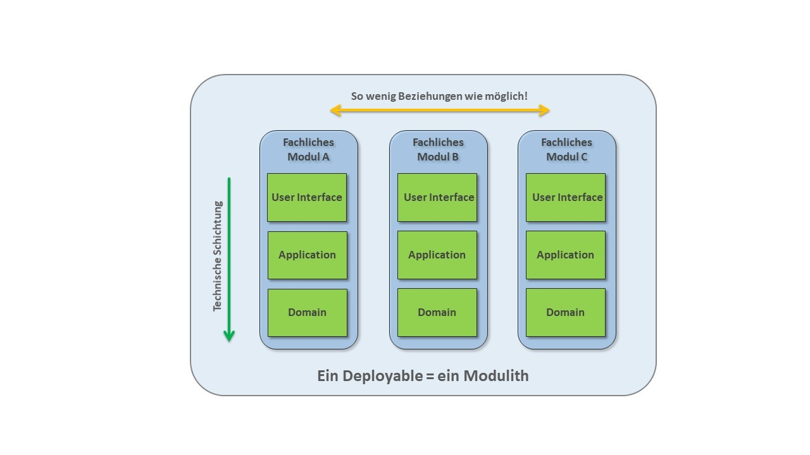
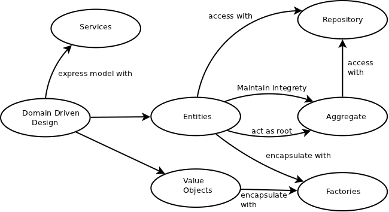
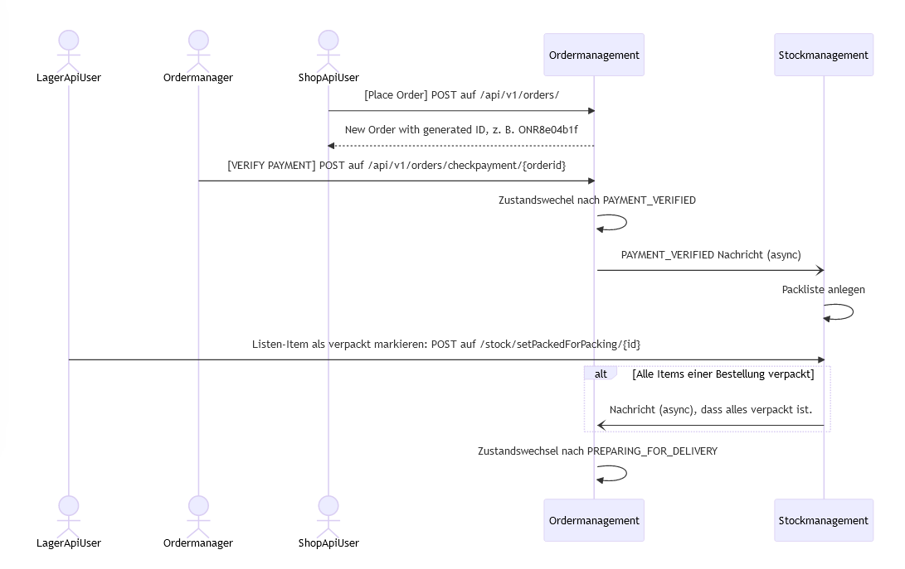

Mitschrift

geht um Softwarearchitektur
wie baut man robuste, skalierbare Softwaresysteme
Ordermanagement ist in Ports and Adapters
Stockmanagement ist schlanker
Klassendiagramme erstellen lassen
einige Codeteile in Doku und beschreiben
bei DDD nur taktische Muster, 
  
### Teil 1  
- Theorie: Recherchiere zu folgenden Fragestellungen und fasse deine Erkenntnisse übersichtlich und illustrativ zusammen!
    - Was ist Sofwarearchitektur?

        - „eine strukturierte oder hierarchische Anordnung der Systemkomponenten sowie Beschreibung ihrer Beziehungen“
        - Architekturkomponenten bilden eine Zerlegung des Gesamtsystems, d.h. jedes Softwareelement ist genau einer Architekturkomponente zugeordnet
        - die Softwarearchitektur wird durch die nicht-funktionalen Eigenschaften (Modifizierbarkeit, Wartbarkeit, Sicherheit, etc.) bestimmt
        - eine einmal eingerichtete Softwarearchitektur ist später nur mit hohem Aufwand abänderbar
        - ist einer der kritischsten und wichtigsten Punkte im Entwicklungsprozess einer Software

    - Wie kann man Softwarearchitektur dokumentieren?

       meist muss es in mehreren Sichten passieren, da man alles nicht in einer Sicht darstellen kann

       mögliche Dokumentationsformen:
        - 4+1 Sichten Modell von Kruchten
        - 4 Sichten von Hofmeister, Nord und Soni
        - Viewtypes und Styles des SEI 
        - Composite Structure Diagram
        - Canonical Model Structure

    - Welches sind die wichtigsten Eigenschaften von Langlebigen Softwarearchitekturen (Lilienthal)

    - Was ist ein Modulith?
        
        Er tritt nach außen als großes Ganzes auf, ist aber im Inneren gut strukturiert und aufgeteilt.
        Laut Dr. Carola Lilienthal ist der Modulith ein gut strukturierter Monolith. Man verfolgt mit dem Modulith hohe Kohäsion und geringe Kopplung.
        Ein gut strukturierter Modulith kann später einfach in Microservices umgemünzt werden, weil er bereits eigenständige Module enthält.
        

    - Wie funktioniert die Ports and Adapters Architektur?

        "Input und Output am Edge von technologieunabhängigen Code (Domain) zu haben; die Domain soll nicht auf Technologien, Framework oder Real World Things referenzieren und nur die Businesslogik enthalten"
        
        Real World Things (Actor) mit denen die Domain interagiert können sein: User, Testfall oder eine Single-Page Application
        Es gibt zwei Typen von Actor: 
            - driving actors (verwenden Domain)
            - driven actors (stellen Funktionalitäten bereit, die von der Domain gebraucht wird)
                - Recipient: empfängt nur (z.B. Drucker)
                - Repository: empfängt und stellt zur Verfügung (z.B. Datenbank)

        An der Kante der Domain befinden sich Ports. Ports sind eine Sammlung von Interaktionen mit eine speziellen Sinn aber ohne vorauszusetzen, dass dieser Port eine spezielle Implementierung braucht (z.B. im Interface ist es egal ob hinter dem Messaging SMS oder Email liegt, es wird die grundlegenden Methoden wie Send() in beiden benötigt und dort in der Implementierung dann für jeden einzelnen ausimplemetiert).

        Es wird wieder in zwei Ports unterschieden:
            - Driving port: spezifiziert wie die Domain verwendet werden kann
            - Driven port: welche Funktionalität braucht die Domain

        Die Actors kommunizieren mit Adapters nur über die Ports. Diese Adapter können als Übersetzungschicht zwischen Domain und Außenwelt angesehen werden.

        Es gibt zwei Typen von Adapter:
            - Driving adapter: konvertiert Anfrage von einer speziellen Technologie in einen technologieunabhängigen Request (z.B. GUI)
            - Driven adapter: konvertiert Aufrufe der Domain von technologieunabhängig in ein technologiespezifisch (z.B. SQL Adapter)

        Zusammengefasst:
        - trennt Corelogik von der Input-Output Infrastruktur (Business Logik von Außenwelt trennen)
        - Entkupplung zwischen Coredomain und Außenwelt (egal was von der Außenwelt kommt, Domain arbeitet intern immer gleich z.B. SQL oder MongoDB ist Domain egal, die Methoden für den Datenbankzugriff sind für sie gleich und werden in der Implementierung für die bestimmten Technologien an die Technologie angepasst)
        

    - DDD: Was sind die wesentlichen Bausteine des modellgetriebenen Entwurfs (Taktische Pattern) aus DDD?
    
        - Entitäten/Entity: nicht durch Eigenschaft sondern Identität definiert (Person ist immer die gleiche Person, auch wenn sich die Eigenschaften ändern)
            - oft mit eindeutigen Identifikatoren modelliert 
            - Mitschrift aus Unterricht (hat Zustand; prüfung ob 2 entites gleich sind - ID muss gleich sein, dynamisch, Bsp Kunde)
        - Wertobjekt/Value Object (durch Eigenschaften definiert, haben/benötigen keine Identität)
            -  üblicherweise als unveränderliche Objekte (immutable) modelliert
            - damit wiederverwendbar und verteilbar
            - Mitschrift aus Unterricht: (immutable, repräsentiert Wert der sich nicht mehr verändert, keine Identität, keinen Lebenszyklus, mit Businesslogik, statisch, Bsp BestellNr.; prüfung ob 2 value object gleich sind - Über Wert)
        - Aggregate/Aggregates (Fassen Entitäten und Wertobjekte und ihre Beziehungen zueinander zu einer transaktionalen Einheit zusammen)
            - nur eine Entität für Zugriff von außen auf gesamtes Aggregat
            - alle andere Entitäten und Wertobjekte von außen nicht statisch referenziert werden
            - damit ist richtige Ausführung (Invarianten) des Aggregats gesichert
        - Services (Funktionalitäten, die ein wichtiges Konzept der Fachlichkeit darstellen und zu mehreren Objekten des Domänenmodells gehören)
            - sind zustandslos/stateless
            - wiederverwendbare klassen ohne Beziehungen
            - mit Methoden, die angebotene Funktionalitäten entsprechen
            - Methoden bekommen Wertobjekte und Entitäten übergeben, die sie zur Abarbeitung der Funktionalität brauchen
        - Repositories (damit technische Infrastruktur sowie alle Zugriffsmechanismen von Geschäftslogikschicht getrennt)
            - für alle Fachobjekt die über Infrastrukturschicht geladen, gibt es eine Repository-Klasse, die die Lade- und Suchtechnologien nach außen kapselt
            - sind Teil des Domänenmodells und somit Teil der Geschäftslogikschicht
            - greifen als einzige Objekte auf Infrastruktur-Schicht zu (Entwurfsmuster dafür wären Data Access Objects, Query Objects oder Metadata Mapping Layers)
        - Fachliche Ereignisse/Domain Events (Objekte, die Aktionen des Domänenmodells beschreiben und ein/mehrere Aktionen/Änderungen in Fachobjekten bewirken)
            - ermöglichen Modellierung von verteilten Systemen
            - Subsysteme kommunizieren ausschließlich über Domain Events
            - somit stark entkoppelt und gesamtes System somit wartbarer und skalierbarer
        - Mitschrift aus Unterricht: Service, Repositories, Aggregates (haben Zustand, der ein, mehrere Entitys oder Value Objects betrifft; Bsp. Bestellung ist Aggregat)
        https://leanpub.com/ddd-referenz/read

- Abgabe der Architekturanalyse des bestehenden erplite-Backends (erplite2-main-2)

    - Dokumentation (texthelle Beschreibung, Codeauszüge, C4-Diagramme, Klassendiagramme) der Ports-Und-Adapters-Architektur und der DDD-Bestandteile (taktische Muster) von Ordermanagement anhand der gegebenen Anwendungsfälle, die schon implementiert sind:
        - Bestellung aufgeben
        - Bestellung auf bezahlt setzen
        - Packliste generieren
        - Packlistenitems abhaken
        - Bestellung auf IN_DELIVERY setzen wenn alle Packlistenitems gepackt sind
    - Wo findet man DDD-Bestandteile?
    - Wo findet man Ports-Und-Adapters-Architektur?
    - Dokumentation (texthelle Beschreibung, Codeauszüge, Diagramme, C4-Diagramme, Klassendiagramme) der "Architektur" von Stockmanagement anhand der gegebenen Anwendungsfälle, die schon implementiert sind:
        - Packingliste anlegen
        - Packingitems als verpackt markieren

### Teil 3
Aufgabe Makroarchitektur Teil 3

    A) Inbetriebnahme der Microservice-Variante von erplite
         als Schritt für Schritt-Anleitung mit Screenshots und Text zu dokumentieren
    B) Abgabe einer Architekturanalyse des bestehenden erplitems-Backends
        B1) Schriftliche Dokumentation der Architektur als C4-Containerdiagramm und C4-Componentendiagramm incl. textuellen Beschreibungen, Codeauszügen und Screenshots.
        B2) Die beschriebenen Use-Cases (Bestellung anlegen, Payment verifizieren, Packlistenitems abhaken) entlang der Architektur beschreiben, Codeauszüge zeigen, Screenshots mit den Resultaten zeigen, textuelle Beschreibungen dazu
erplitewithmicroservice-main-4