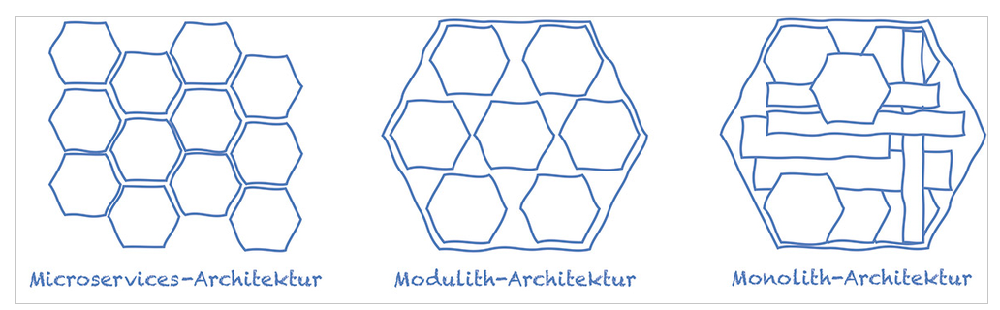
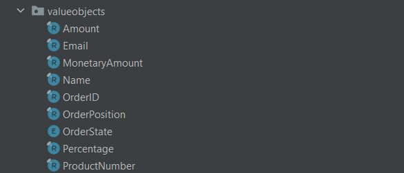
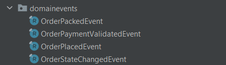
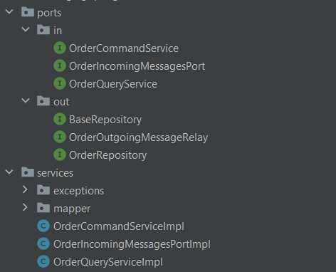
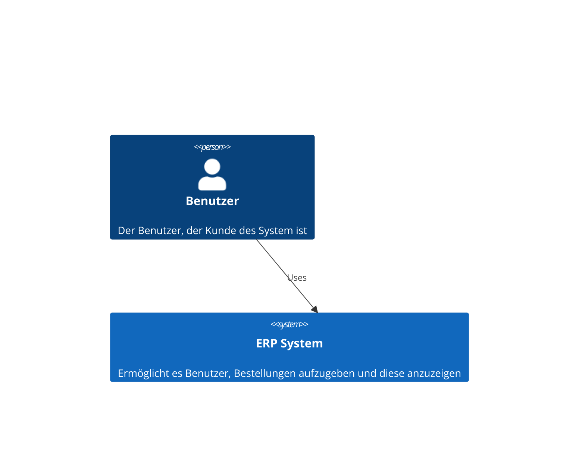
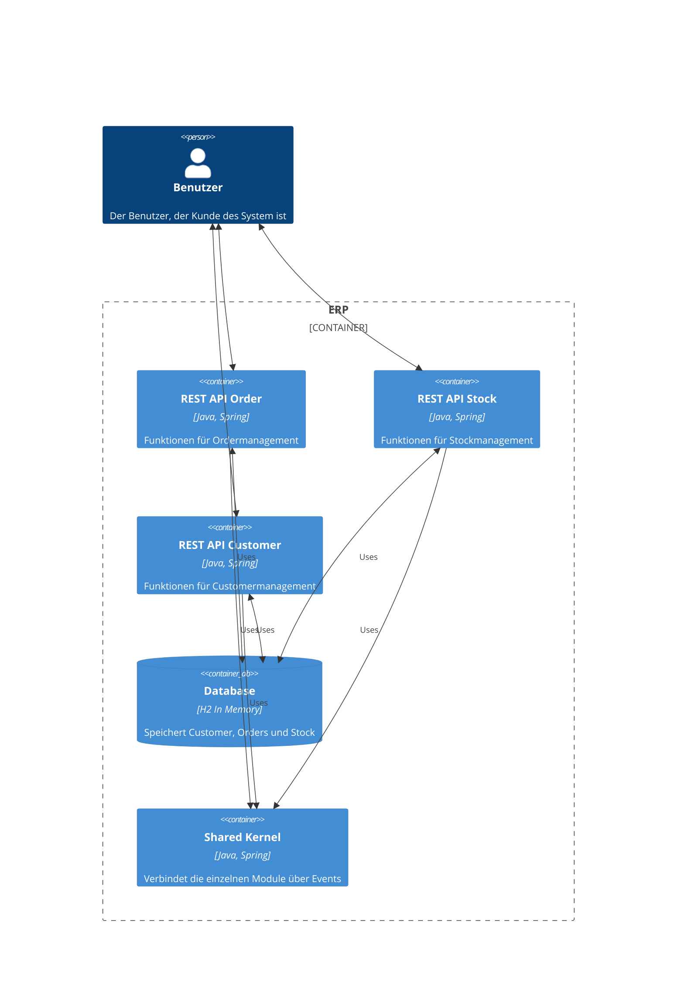
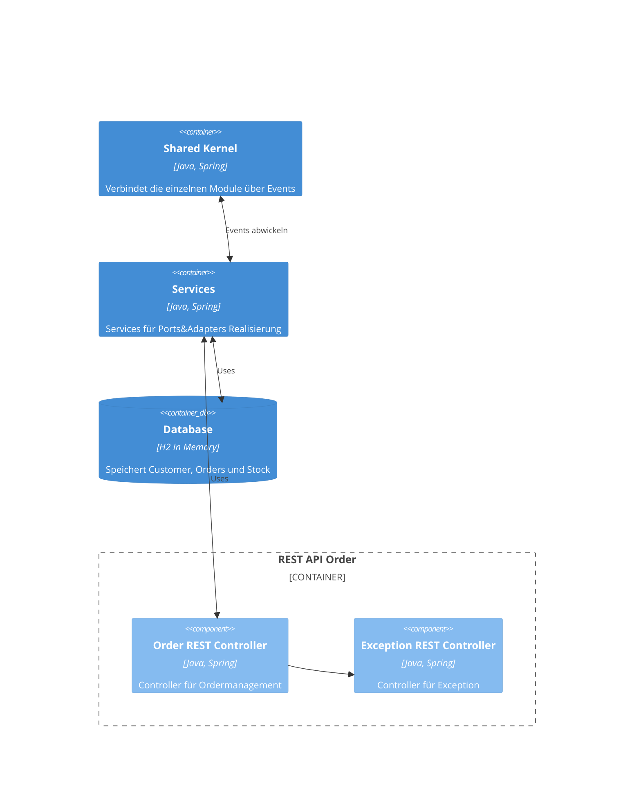
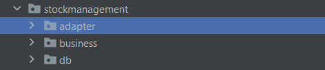
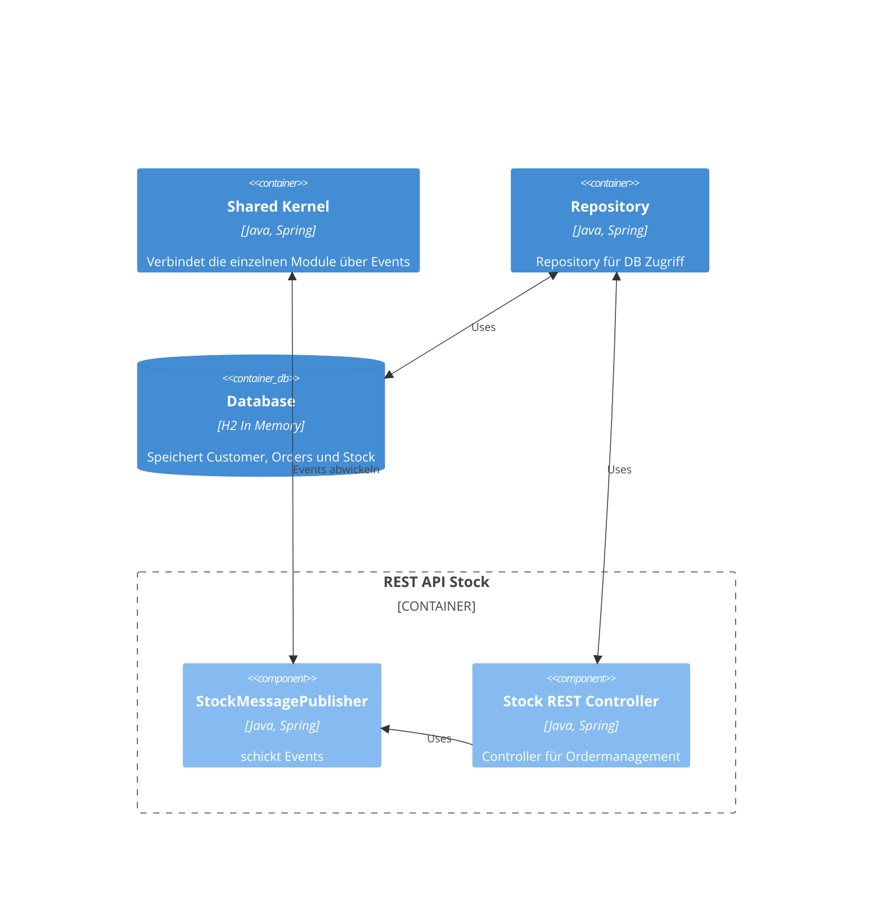
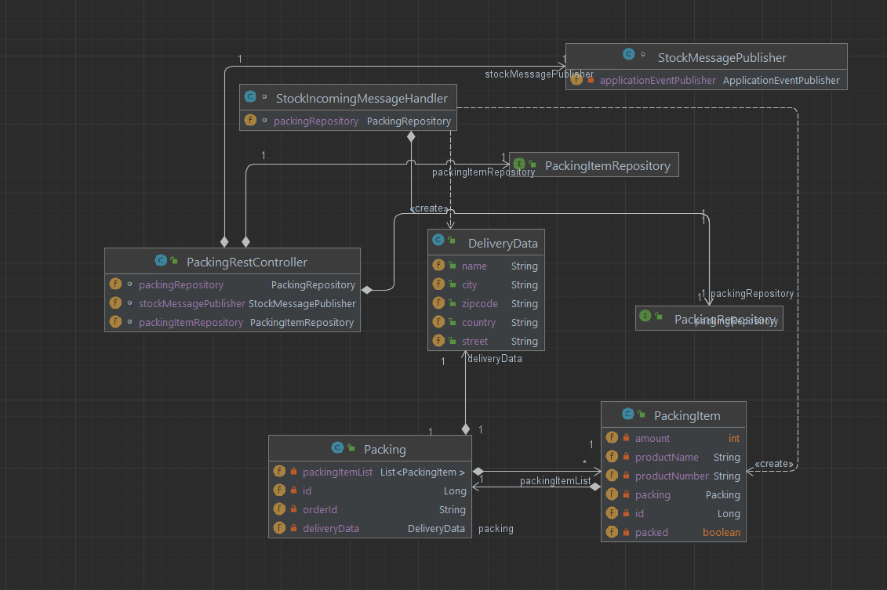

# Teil 1  
- Theorie: Recherchiere zu folgenden Fragestellungen und fasse deine Erkenntnisse übersichtlich und illustrativ zusammen!
    - Was ist Sofwarearchitektur?

        - „eine strukturierte oder hierarchische Anordnung der Systemkomponenten sowie Beschreibung ihrer Beziehungen“
        - Architekturkomponenten bilden eine Zerlegung des Gesamtsystems, d.h. jedes Softwareelement ist genau einer Architekturkomponente zugeordnet
        - die Softwarearchitektur wird durch die nicht-funktionalen Eigenschaften (Modifizierbarkeit, Wartbarkeit, Sicherheit, etc.) bestimmt
        - eine einmal eingerichtete Softwarearchitektur ist später nur mit hohem Aufwand abänderbar
        - ist einer der kritischsten und wichtigsten Punkte im Entwicklungsprozess einer Software

    - Wie kann man Softwarearchitektur dokumentieren?

       meist muss es in mehreren Sichten passieren, da man alles nicht in einer Sicht darstellen kann

       mögliche Dokumentationsformen:
        - 4+1 Sichten Modell von Kruchten
        - 4 Sichten von Hofmeister, Nord und Soni
        - Viewtypes und Styles des SEI 
        - Composite Structure Diagram
        - Canonical Model Structure

    - Welches sind die wichtigsten Eigenschaften von Langlebigen Softwarearchitekturen (Lilienthal)
        - **Entwurf nach Zuständigkeit**: Sind die Bausteine eines Systems modular gestaltet, so sollte man für jeden Baustein die Frage beantworten können: Was ist sein Aufgabe? Der entscheidende Punkt dabei ist, dass der Baustein wirklich eine Aufgabe hat und nicht mehrere. Diese Frage ist natürlich nur im fachlichen Kontext des jeweiligen Systems gemeinsam mit dem Entwicklerteam zu klären. Anhaltspunkte bei der Suche nach Bausteinen mit unklarer Zuständigkeit sind:
        - Der Name des Bausteins – der Name sollte seine Aufgabe beschreiben. Ist der Name schwammig, so sollte man ihn sich ansehen.
        - Seine Größe (s. nächster Punkt).
        - Der Umfang seiner Kopplung mit anderen Bausteinen – wird ein Baustein sehr viel von allen möglichen anderen Bausteinen verwendet, so liegt die Vermutung nahe, dass er ein Sammelbecken von vielfältigen nicht unbedingt zusammenhängenden Funktionalitäten ist.
        - Seine mangelnde Musterkonsistenz.
        - **Ausgewogene Größenverhältnisse**: Bausteine, die auf einer Ebene liegen, also die Schichten, die fachlichen Module, die Packages, die Klassen oder die Methoden, sollten untereinander ausgewogene Größenverhältnisse haben. Hier lohnt es sich, die sehr großen Bausteine zu untersuchen, um festzustellen, ob sie Kandidaten für eine Zerlegung sind.
        - **Zusammengehörigkeit durch Kopplung untereinander** : Bausteine sollten Subbausteine enthalten, die zusammengehören. Eine Klasse sollte beispielsweise Methoden enthalten, die gemeinsam ein Ganzes ergeben. Dasselbe gilt für größere Bausteine, wie Packages, Komponenten, Module und Schichten. Haben die Subbausteine mehr mit anderen Bausteinen zu tun, als mit ihren "Schwestern und Brüdern", dann stellt sich die Frage, ob sie nicht eigentlich in einen anderen Baustein gehören.

    - Was ist ein Modulith?
        
        Er tritt nach außen als großes Ganzes auf, ist aber im Inneren gut strukturiert und aufgeteilt.
        Laut Dr. Carola Lilienthal ist der Modulith ein gut strukturierter Monolith. Man verfolgt mit dem Modulith hohe Kohäsion und geringe Kopplung.
        Ein gut strukturierter Modulith kann später einfach in Microservices umgemünzt werden, weil er bereits eigenständige Module enthält.
        

        - Microservices - physikalisch und logisch getrennt
        - Modulith - physikalisch ganz, logisch getrennt
        - Monolith - physikalisch und logisch ganz

    - Wie funktioniert die Ports and Adapters Architektur?

        "Input und Output am Edge von technologieunabhängigen Code (Domain) zu haben; die Domain soll nicht auf Technologien, Framework oder Real World Things referenzieren und nur die Businesslogik enthalten"
        
        Real World Things (Actor) mit denen die Domain interagiert können sein: User, Testfall oder eine Single-Page Application
        Es gibt zwei Typen von Actor: 
            - driving actors (verwenden Domain)
            - driven actors (stellen Funktionalitäten bereit, die von der Domain gebraucht wird)
                - Recipient: empfängt nur (z.B. Drucker)
                - Repository: empfängt und stellt zur Verfügung (z.B. Datenbank)

        An der Kante der Domain befinden sich Ports. Ports sind eine Sammlung von Interaktionen mit eine speziellen Sinn aber ohne vorauszusetzen, dass dieser Port eine spezielle Implementierung braucht (z.B. im Interface ist es egal ob hinter dem Messaging SMS oder Email liegt, es wird die grundlegenden Methoden wie Send() in beiden benötigt und dort in der Implementierung dann für jeden einzelnen ausimplemetiert).

        Es wird wieder in zwei Ports unterschieden:
            - Driving port: spezifiziert wie die Domain verwendet werden kann
            - Driven port: welche Funktionalität braucht die Domain

        Die Actors kommunizieren mit Adapters nur über die Ports. Diese Adapter können als Übersetzungschicht zwischen Domain und Außenwelt angesehen werden.

        Es gibt zwei Typen von Adapter:
            - Driving adapter: konvertiert Anfrage von einer speziellen Technologie in einen technologieunabhängigen Request (z.B. GUI)
            - Driven adapter: konvertiert Aufrufe der Domain von technologieunabhängig in ein technologiespezifisch (z.B. SQL Adapter)

        Zusammengefasst:
        - trennt Corelogik von der Input-Output Infrastruktur (Business Logik von Außenwelt trennen)
        - Entkupplung zwischen Coredomain und Außenwelt (egal was von der Außenwelt kommt, Domain arbeitet intern immer gleich z.B. SQL oder MongoDB ist Domain egal, die Methoden für den Datenbankzugriff sind für sie gleich und werden in der Implementierung für die bestimmten Technologien an die Technologie angepasst)
        

    - DDD: Was sind die wesentlichen Bausteine des modellgetriebenen Entwurfs (Taktische Pattern) aus DDD?
    
        - Entitäten/Entity: nicht durch Eigenschaft sondern Identität definiert (Person ist immer die gleiche Person, auch wenn sich die Eigenschaften ändern)
            - oft mit eindeutigen Identifikatoren modelliert 
            - Mitschrift aus Unterricht (hat Zustand; prüfung ob 2 entites gleich sind - ID muss gleich sein, dynamisch, Bsp Kunde)
        - Wertobjekt/Value Object (durch Eigenschaften definiert, haben/benötigen keine Identität)
            -  üblicherweise als unveränderliche Objekte (immutable) modelliert
            - damit wiederverwendbar und verteilbar
            - Mitschrift aus Unterricht: (immutable, repräsentiert Wert der sich nicht mehr verändert, keine Identität, keinen Lebenszyklus, mit Businesslogik, statisch, Bsp BestellNr.; prüfung ob 2 value object gleich sind - Über Wert)
        - Aggregate/Aggregates (Fassen Entitäten und Wertobjekte und ihre Beziehungen zueinander zu einer transaktionalen Einheit zusammen)
            - nur eine Entität für Zugriff von außen auf gesamtes Aggregat
            - alle andere Entitäten und Wertobjekte von außen nicht statisch referenziert werden
            - damit ist richtige Ausführung (Invarianten) des Aggregats gesichert
        - Services (Funktionalitäten, die ein wichtiges Konzept der Fachlichkeit darstellen und zu mehreren Objekten des Domänenmodells gehören)
            - sind zustandslos/stateless
            - wiederverwendbare klassen ohne Beziehungen
            - mit Methoden, die angebotene Funktionalitäten entsprechen
            - Methoden bekommen Wertobjekte und Entitäten übergeben, die sie zur Abarbeitung der Funktionalität brauchen
        - Repositories (damit technische Infrastruktur sowie alle Zugriffsmechanismen von Geschäftslogikschicht getrennt)
            - für alle Fachobjekt die über Infrastrukturschicht geladen, gibt es eine Repository-Klasse, die die Lade- und Suchtechnologien nach außen kapselt
            - sind Teil des Domänenmodells und somit Teil der Geschäftslogikschicht
            - greifen als einzige Objekte auf Infrastruktur-Schicht zu (Entwurfsmuster dafür wären Data Access Objects, Query Objects oder Metadata Mapping Layers)
        - Fachliche Ereignisse/Domain Events (Objekte, die Aktionen des Domänenmodells beschreiben und ein/mehrere Aktionen/Änderungen in Fachobjekten bewirken)
            - ermöglichen Modellierung von verteilten Systemen
            - Subsysteme kommunizieren ausschließlich über Domain Events
            - somit stark entkoppelt und gesamtes System somit wartbarer und skalierbarer
        - Mitschrift aus Unterricht: Service, Repositories, Aggregates (haben Zustand, der ein, mehrere Entitys oder Value Objects betrifft; Bsp. Bestellung ist Aggregat)
        https://leanpub.com/ddd-referenz/read

## Abgabe der Architekturanalyse des bestehenden erplite-Backends (erplite2-main-2)


Dokumentation (texthelle Beschreibung, Codeauszüge, C4-Diagramme, Klassendiagramme) der Ports-Und-Adapters-Architektur und der DDD-Bestandteile (taktische Muster) von Ordermanagement anhand der gegebenen Anwendungsfälle, die schon implementiert sind:
### Bestellung aufgeben
über den Rest-Controller wird ein POST auf orders gemacht   
                                 
```java
//OrderRestController.java
//der JSON wird als PlaceOrderCommand übergeben
//ein PlaceOrderCommand wird benötigt, dass alle wissen, wie so ein Order aussehen muss, ohne Abhängigkeiten zu Ordermanagement herzustellen
@PostMapping("/orders/")
public ResponseEntity placeNewOrder(@RequestBody @Valid PlaceOrderCommand placeOrderCommand, BindingResult bindingResult) {
    Logger.getLogger(this.getClass().getName()).log(Level.INFO, "Handling place new order api request ...");

    HashMap<String, String> errors = new HashMap<>();

    if (bindingResult.hasErrors()) {
        Logger.getLogger(this.getClass().getName()).log(Level.WARNING, "Errors in placeOrderCommand detected!");
        for (FieldError fieldError : bindingResult.getFieldErrors()) {
            errors.put(fieldError.getField(), fieldError.getDefaultMessage());
        }
        throw new OrderPlacedFieldValidationException("Validation errors for order placement!", errors);
    }

    //über Servicelayer wird das neue Order in handle gemappt mit den richtigen Typen und ein Order gebaut
    OrderResponse orderResponse = orderCommandService.handle(placeOrderCommand);

    String resourceLocation = ServletUriComponentsBuilder.fromCurrentContextPath().build().toUriString() + "/orders/" + orderResponse.orderID();
    try {
        //GET Request mit OrderID aus OrderResponse
        //Ergebnis wird an den aufrufenden Client zurückgesendet
        return ResponseEntity.created(new URI(resourceLocation)).body(orderResponse);
    } catch (URISyntaxException e) {
        return ResponseEntity.noContent().build();
    }
}
```  
```java
//OrderCommandServiceImpl.java
@Transactional
public OrderResponse handle(PlaceOrderCommand placeOrderCommand) {
    /**Code ausgelassen**/
    //LineItems von CartItem aus PlaceOrderCommand erstellen
    List<LineItem> lineItemList = new ArrayList<>();
    int i = 1;
    for (CartItem cartItem : placeOrderCommand.cartItems()) {
        lineItemList.add(new LineItem(
                        new OrderPosition(i),
                        new ProductNumber(cartItem.productNumber()),
                        new Name(cartItem.productName()),
                        new MonetaryAmount(new BigDecimal(cartItem.priceNet())),
                        new Percentage(cartItem.tax()),
                        new Amount(cartItem.amount())
                )
        );
        i++;
    }

    //Order aus PlaceOrderCommand bauen
    Order orderToInsert = new Order(
            new OrderID("ONR" + UUID.randomUUID().toString().substring(0, 7)),
            new CustomerData(
                    new CustomerID(placeOrderCommand.customerID()),
                    new Name(placeOrderCommand.customerFirstname()),
                    new Name(placeOrderCommand.customerLastname()),
                    new Email(placeOrderCommand.customerEmail()),
                    placeOrderCommand.customerStreet(),
                    placeOrderCommand.customerZipcode(),
                    placeOrderCommand.customerCity(),
                    placeOrderCommand.customerCountry()
            ),
            LocalDateTime.now(),
            lineItemList,
            OrderState.PLACED
    );

    //über das Repository wird das Order eingefügt und bekommt die fertige Order als Optional zurück
    Optional<Order> orderOptional = this.orderRepository.insert(orderToInsert);

    if (orderOptional.isPresent()) {
        Logger.getLogger(this.getClass().getName()).log(Level.INFO, "Publishing order placed domain event ...");
        //Event wird getriggert (über Port OrderOutgoingMessageRelay), dass Order erstellt wurde und auch der Inhalt der Order wird ausgegeben
        orderOutgoingMessageRelay.publish(new OrderPlacedEvent(OrderResponseMapper.toResponseFromDomain(orderOptional.get())));
        //aus Order wird eine OrderResponse gemappt, diese an den aufrufenden REST-Controller zurückgeliefert
        return OrderResponseMapper.toResponseFromDomain(orderOptional.get());
    } else {
        throw new OrderPlacementNotSuccessfullException("OrderQueryServiceImpl: Order could not be placed!");
    }
}
``` 
### Bestellung auf bezahlt setzen


```java
//OrderRestController.java

//im Rest-Controller wird auf checkPayment mit OrderID
@PostMapping("/orders/checkpayment/{orderid}")
public ResponseEntity validatePaymentForOrderWithId(@PathVariable String orderid) {
    Logger.getLogger(this.getClass().getName()).log(Level.INFO, "Handling check payment for order api request ...");

    //über Servicelayer wird an handle als OrderPaymentCheckCommand übergeben
    this.orderCommandService.handle(new OrderPaymentCheckCommand(orderid));
    //aufrufender Client bekommt ein Accepted zurück
    return ResponseEntity.accepted().body("Order payment check executed. Order payment ok!");
}
```
```java
@Override
@Transactional
public void handle(OrderPaymentCheckCommand orderPaymentCheckCommand) throws OrderPaymentCheckFailedException {
    /**Code ausgelassen**/
    //Order über Repository aus DB holen mit OrderID
    Optional<Order> optionalOrderToCheck = this.orderRepository.getById(new OrderID(orderPaymentCheckCommand.orderID()));
    if (optionalOrderToCheck.isPresent()) {
        //Order aus dem Optional holen
        Order order = optionalOrderToCheck.get();
        try { //versuchen, den State zu verändern
            order.orderStateTransitionTo(OrderState.PAYMENT_VERIFIED);
            //State auch in der DB aktualisieren
            this.orderRepository.updateOrderWithNewState(order);
            //Event getriggert, dass Payment verifiziert ist, mit OrderResponseMapper in OrderResponse mappen
            this.orderOutgoingMessageRelay.publish(new OrderPaymentValidatedEvent(OrderResponseMapper.toResponseFromDomain(order)));
            Logger.getLogger(this.getClass().getName()).log(Level.INFO, "Payment validated event published!");
        } catch (OrderStateChangeNotPossibleException orderStateChangeNotPossibleException) {
            throw new OrderPaymentCheckFailedException("Order payment check not possible. Order in wrong state! " + orderStateChangeNotPossibleException.getMessage());
        }
    } else {
        throw new OrderPaymentCheckFailedException("Order with Id " + orderPaymentCheckCommand.orderID() + " not found for payment check!");
    }
}
```
### Packliste generieren


```java
//PackingRestController.java
//Packing List für ein spezielles Order abrufen
@GetMapping("/packings/whithorderid/{ordernr}")
public ResponseEntity<Packing> getPackingByOrderNr(@PathVariable String ordernr) {
    //über Repository werden die PackingItems geholt und in Packing in Liste eingefügt
    Packing p = this.packingRepository.findByOrderId(ordernr);
    if (p != null) {
        return ResponseEntity.ok(p);
    } else {
        return ResponseEntity.notFound().build();
    }
}
```
```java
//StockIncomingMessageHandler.java
//wenn Payment Verifizierung erfolgreich, wird Event von OrderOutgoingSpringMessageRelayImpl veröffentlicht
//diese wird von StockIncomingMessageHandler erkannt und erstellt dann ein Packing und die PackingItemList
public void onApplicationEvent(OrderPaymentValidatedSpringEvent event) {
Logger.getLogger(this.getClass().getName()).log(Level.INFO, "Handling order payment validated spring event ...");

//aus dem Event die OrderResponse holen
OrderResponse orderResponse = event.getOrderResponse();

//leeres Packing erstellen
Packing packingToSaveToDb =
        Packing.builder()
                .id(null)
                .orderId(orderResponse.orderID())
                .deliveryData(new DeliveryData(
                                orderResponse.customerFirstname() + " " + orderResponse.customerLastname(),
                                orderResponse.customerStreet(),
                                orderResponse.customerZipcode(),
                                orderResponse.customerCity(),
                                orderResponse.customerCountry()
                        )
                ).packingItemList(null) // List is generated down under
                .build();

//PackingItemList in leerem Packing mit den Werten aus OrderResponse befüllen
List<PackingItem> packingItemList = new ArrayList<>();
for (LineItemResponse lineItemResponse : orderResponse.orderLineItems()) {
    packingItemList.add(
            new PackingItem(
                    null,
                    lineItemResponse.productNumber(),
                    lineItemResponse.productName(),
                    lineItemResponse.amount(),
                    false,
                    packingToSaveToDb
            )
    );
}
//PackingItemList setzen
packingToSaveToDb.setPackingItemList(packingItemList);
//Packing über Repository speichern
this.packingRepository.save(packingToSaveToDb);
Logger.getLogger(this.getClass().getName()).log(Level.INFO, "New packing list created and saved in db ...");
}
```
### Packlistenitems abhaken
```java
//PackingRestController.java
//Über PackingItemId wird PackingItem in Packing als verpackt gesetzt
@PostMapping("/setPackedForPacking/{packingItemId}")
public void setPackingItemPackedForPacking(@PathVariable Long packingItemId) {
Logger.getLogger(this.getClass().getName()).log(Level.INFO, "Handling packing for item# " + packingItemId);

//PackingItem mit Repository herausholen
Optional<PackingItem> optionalPackingItem = this.packingItemRepository.findById(packingItemId);
if (optionalPackingItem.isPresent()) {
    PackingItem packingItem = optionalPackingItem.get();
    //Packed auf true setzen
    packingItem.setPacked(true);
    //PackingItem über Repository wieder speichern
    packingItemRepository.save(packingItem);

    
    Long packingId = packingItem.getPacking().getId();
    //Packing des PackingItem holen
    Optional<Packing> packing = this.packingRepository.findById(packingId);

    boolean allpaked = true;
    for (PackingItem item : packing.get().getPackingItemList()) { //alle PackingItems prüfen, ob sie packed sind
        if (!item.isPacked()) allpaked = false;
    }

    if (allpaked) {//wenn alle verpackt sind
        Logger.getLogger(this.getClass().getName()).log(Level.INFO, "All items for order# " + packing.get().getOrderId() + "packed. Publishing event ...");
        this.stockMessagePublisher.publishOrderPackedSpringEventForOrderId(packing.get().getOrderId()); //Event (OrderPackedEvent) veröffentlichen, dass Packing fertig ist
    }
}
}
```
### Bestellung auf IN_DELIVERY setzen wenn alle Packlistenitems gepackt sind

```java
//Event OrderPackedEvent wurde veröffentlicht und triggert nun diesen Methodenaufruf
@Transactional
public void handle(OrderPackedEvent orderPackedEvent) {
    //Meterialize object into Memory, place changes, and forward the domain object to repository
    //this ensures, that businesslogic will be executed und object is in consistent state.
    Logger.getLogger(this.getClass().getName()).log(Level.INFO, "Handling order packed event ...");

    //Über Repository die Order holen, OrderID aus OrderPackedEvent bekommen
    Optional<Order> optionalOrderToCheck = this.orderRepository.getById(orderPackedEvent.orderId());
    if (optionalOrderToCheck.isPresent()) {
        Order order = optionalOrderToCheck.get();
        try {

            //State der Order auf PREAPRING_FOR_DELIVERY
            order.orderStateTransitionTo(OrderState.PREPARING_FOR_DELIVERY);
            //Order updaten
            this.orderRepository.updateOrderWithNewState(order);
            Logger.getLogger(this.getClass().getName()).log(Level.INFO, "Order state changed to preparing_for_delivery, changed order persisted!");
        } catch (OrderStateChangeNotPossibleException orderStateChangeNotPossibleException) {
            throw new OrderPaymentCheckFailedException("Order state change to preparing for delivery not possible! " + orderStateChangeNotPossibleException.getMessage());
        }
    } else {
        throw new OrderWithGivenIDNotFoundException("Order with Id " + orderPackedEvent.orderId().id() + " not found for state change to preparing for delivery!");
    }

}
```

### Wo findet man DDD-Bestandteile?
in Ordermanagement sind
#### Value Objects

```java
//Beispiel Amount
@ValueObjectMarker
public record Amount(int amount) {
    public Amount {
        if (!isValid(amount)) throw new IllegalArgumentException("Amount must not be positive integer!");
    }

    public static boolean isValid(int amount) {
        return amount >= 0;
    }
}
```
##### Aggregates
```java
@AggregateMarker
public final class Order {

    //ID
    private final OrderID orderID;

    //Customer-Data
    private CustomerData customerData;

    //Line-Items
    private final List<LineItem> lineItems;

    //Order-State and calcuated values
    private OrderState state;
    private final MonetaryAmount taxTotal;
    private final MonetaryAmount netTotal;
    private final MonetaryAmount grossTotal;
    private final LocalDateTime date;

    public Order(OrderID orderID, CustomerData customerData,
                 LocalDateTime date, List<LineItem> lineItems, OrderState status) {
        if (orderID == null) throw new IllegalArgumentException("OrderID must not be null!");
        this.orderID = orderID;
        if (customerData == null)
            throw new IllegalArgumentException("Customer-Data for order invalid!");
        this.customerData = customerData;
        if (lineItems == null)
            throw new IllegalArgumentException("LineItems-List must not be null, at least an empy List is needed!");
        this.lineItems = lineItems;
        if (status == null) throw new IllegalArgumentException("State must not be null!");
        this.state = status;
        this.taxTotal = this.calculateOrderTax();
        this.netTotal = this.calculateOrderNetTotal();
        this.grossTotal = this.calculateOrderGrossTotal();
        this.date = date;
    }

    public List<LineItem> getLineItems() {
        return Collections.unmodifiableList(this.lineItems);
    }

    public void orderStateTransitionTo(OrderState newState) {
        switch (newState) {
            case CANCELED -> {
                if (this.state == OrderState.IN_DELIVERY || this.state == OrderState.DELIVERED)
                    throw new OrderStateChangeNotPossibleException("Order in State " + this.state + " cannot be canceled");
                this.state = newState;
            }
            case PAYMENT_VERIFIED -> {
                if (this.state != OrderState.PLACED)
                    throw new OrderStateChangeNotPossibleException("Order must be in state PLACED for transition to PAYMENT VERIFIED!");
                this.state = newState;
            }
            case PREPARING_FOR_DELIVERY -> {
                if (this.state != OrderState.PAYMENT_VERIFIED)
                    throw new OrderStateChangeNotPossibleException("Order must be in state PAYMENT VERIFED for transition to PREPARING FOR DELIVERY!");
                this.state = newState;
            }
            case IN_DELIVERY -> {
                if (this.state != OrderState.PREPARING_FOR_DELIVERY)
                    throw new OrderStateChangeNotPossibleException("Order must be in state PREPARING FOR DELIVERY for transition to IN DELIVERY!");
                this.state = newState;
            }
            case DELIVERED -> {
                if (this.state != OrderState.IN_DELIVERY)
                    throw new OrderStateChangeNotPossibleException("Order must be in state IN DELIVERY for transition to DELIVERED!");
                this.state = newState;
            }
        }
    }
    /**Code ausgelassen**/

}
```
#### Repositories
```java
@RepositoryMarker
@Repository
class OrderRepositoryImpl implements OrderRepository {

    @Autowired
    private OrderJPARepository orderJPARepository;

    @Override
    public Optional<Order> insert(Order order) {
        if (order == null) throw new IllegalArgumentException("Order to be inserted must not be null!");
        OrderDbEntity orderDbEntity = DbOrderMapperService.toOrm(order);
        OrderDbEntity insertedEntity = orderJPARepository.save(orderDbEntity);
        if (insertedEntity == null) return Optional.empty();
        return Optional.of(DbOrderMapperService.toDomain(insertedEntity));
    }

    @Override
    public Optional<Order> getById(OrderID id) {
        if (id == null) throw new IllegalArgumentException("OrderID for Order to get from db must not be null!");
        Optional<OrderDbEntity> orderEntityOptional = this.orderJPARepository.findById(id.id());
        if (!orderEntityOptional.isPresent()) return Optional.empty();
        return Optional.of(DbOrderMapperService.toDomain(orderEntityOptional.get()));
    }

    @Override
    public List<Order> getAll() {
        List<OrderDbEntity> list = this.orderJPARepository.findAll();
        if (list == null) return Collections.emptyList();
        return list.stream().map(dbEntity -> DbOrderMapperService.toDomain(dbEntity)).toList();
    }


    @Override
    public void deleteById(OrderID id) {
        this.orderJPARepository.deleteById(id.id());
    }

    /**Code ausgelassen**/
}
```
#### Events zwischen Aggregate

```java
@Service
@AllArgsConstructor
class IncomingOrderPackedSpringEventHandler implements ApplicationListener<OrderPackedSpringEvent> {

    private OrderIncomingMessagesPort orderIncomingMessagesPort;

    @Override
    @Async("threadPoolTaskExecutor")
    public void onApplicationEvent(OrderPackedSpringEvent event) {
        Logger.getLogger(this.getClass().getName()).log(Level.INFO, "Order packed event received for order# " + event.getOrderID());
        this.orderIncomingMessagesPort.handle(new OrderPackedEvent(new OrderID(event.getOrderID())));
    }
}
```
### Wo findet man Ports-Und-Adapters-Architektur?

- die Ports sind die Interfaces
- die Adapter sind die zugehörigen Implementierungen
- es gibt mehrere Schichten: Domäne, Service, Infrastructure
- wenn sich die Technologie bei einem Adapter verändert, hat dies keine Auswirkungen auf das restliche System; diese Änderung kann einfach implementiert werden

### C4 Diagramm
Context

Container

Component - Ordermanagement

Die Code Ebene ist oben genauer mit Codebeispielen beschrieben und als Klassendiagramm verfügbar.

## Dokumentation (texthelle Beschreibung, Codeauszüge, Diagramme, C4-Diagramme, Klassendiagramme) der "Architektur" von Stockmanagement anhand der gegebenen Anwendungsfälle, die schon implementiert sind:
- Packingliste anlegen
- Packingitems als verpackt markieren

Ist eine Art der 3-Schichten-Architektur mit Events und Ports
- Rest Controller verwendet direkt Repository (package db) über Port
- Rest Controller published Events
- diese Events werden von den Listeners dann aufgefangen und verarbeitet
- in package business liegen die Entitäten ohne Businesslogik
- nur über die Events sind die verschiedenen Managements verbunden und über den sharedkernel (dort ist alles enthalten, damit die Kommunikation erfolgreich ist)


### C4 Diagramm
Context

Container

Component - Stockmanagement



### Teil 3
Aufgabe Makroarchitektur Teil 3

A) Inbetriebnahme der Microservice-Variante von erplite als Schritt für Schritt-Anleitung mit Screenshots und Text zu dokumentieren
add maven project in maven reiter
vscode -> frontend öffnen, readme, dockercompose (complex - adminer+phpmyadmin, simple - adminer)

start mit servicediscovery - hängen sich mit ip und port ein, damit kommunikation funkt
orderservice, delivery, stock, apigateway
use services anhaken
frontend mit go live server starten (muss unter port 5500 anfragen, weil sonst rückantwort nicht gegeben)
rabbitmq login guest guest

servicediscovery - dns
unterschiedliche architekturen bei order,stock,delivery
command, event = dto

#### 1 alle Services einbinden


#### 2 IP Adresse anpassen (wenn nötig)
Da die Dockerinstanz auf einer virtuellen Maschine läuft, muss die IP-Adresse angepasst werden (statt localhost); 
das muss in jeder application.properties (delivery,order,stock) durchgeführt werden


#### 3 Docker-Compose hochfahren
alle Container mit der Docker Compose hochfahren; Images werden gepulled wenn noch nicht verfügbar


#### 4 Services hochfahren
Reihenfolge: Service Discovery, Order, Stock, Delivery, ApiGateway

#### Frontend hochfahren
Frontend mit Go Live Server starten, da nur Zugriff über Port 5500 erlaubt


B) Abgabe einer Architekturanalyse des bestehenden erplitems-Backends
    B1) Schriftliche Dokumentation der Architektur als C4-Containerdiagramm und C4-Componentendiagramm incl. textuellen Beschreibungen, Codeauszügen und Screenshots.
    B2) Die beschriebenen Use-Cases (Bestellung anlegen, Payment verifizieren, Packlistenitems abhaken) entlang der Architektur beschreiben, Codeauszüge zeigen, Screenshots mit den Resultaten zeigen, textuelle Beschreibungen dazu