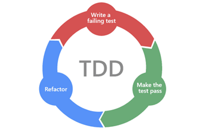
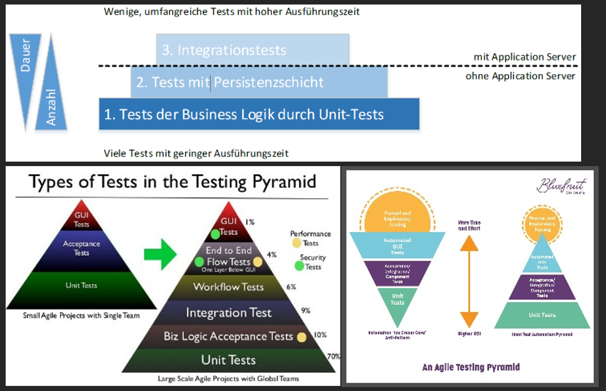
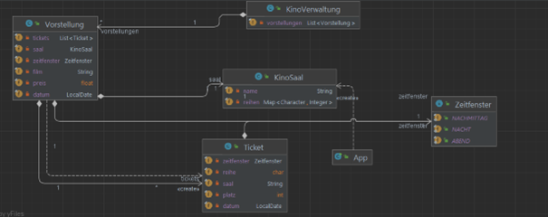
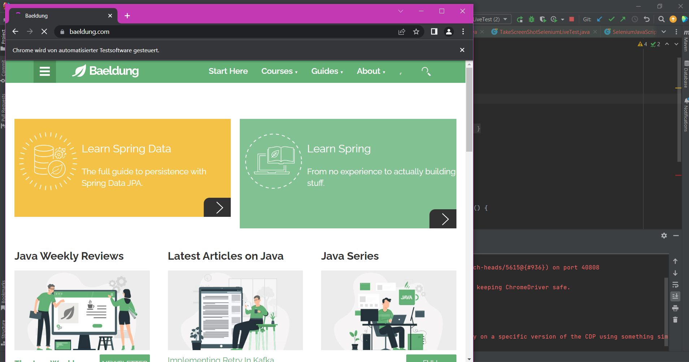

# Übung TDD


## Aufgabe 1: Theorie

Arbeite dich in die Theorie zum Thema Testen bzw. Test-Driven-Development (TDD) ein. Nutze dazu die Materialien aus den verschiedenen „Input“ Abschnitten im Themenbereich „Test-Driven Development“ unseres Moodle-Kurses (https://moodle.tsn.at/course/view.php?id=24763#section-8). Nach dieser Aufgabe musst du folgende Punkte erklären können:

- Testdriven Development
    - zuerst die Tests und dann den Code
    - TDD-Cycle – Red-Green-Refactor
    - Positiver Seiteneffekt: weil noch kein Code entsteht, stellt man sich die Frage, was erwartet man; somit nicht nur Happy Day betrachtet, auch Fehler, Edgecases
    - Wandel bereits von manuellen Testen zu automatisierten Tests
- Red-Green-Refactor
    - Test initial rot
	- Code schreiben bis Test grün
	- Refactor des Codes (Kommentare, Variable umbenennen, in Architektur umwandeln, etc.)
- FIRST-Acronym
	- F – Fast
	- I – Independent
	- R – Repeatable
	- S – Self Validating
	- T - Timely
- Kent Beck (welche Rolle spielt er in Bezug auf TDD)
	- einer der drei Begründer von Extreme Programming (XP)
	- Erfinder des Smalltalk-Testframeworks SUnit und Miterfinder von JUnit

**Testarten**

- Unit-Tests (Sociable, Solitary, Mocks)
    - Testen von Grundbausteinen/einzelnen Teilen
    - z.B. eine einzelne Funktion als Unit ansehen
    - funktioniert gut, wenn Funktionen isoliert voneinander sind
    - und wenn sie pure sind, nur von Eingabe abhängig (I/O) und nicht von einem State
    - Testfundament – machen Masse von Tests
    - schnell
- Integrationstests
    - Testen Zusammenspiel von mehreren Programmbausteinen
    - Testen, ob definierte Schnittstellen korrekt implementiert sind
    - Spezielle Testumgebungen
- UI-Tests / End-To-End Tests / Systemtests
    - UI-Tests: Unit-Tests für UI-Komponenten
    - Systemtests: Funktionsfähigkeit des gesamten Systems entsprechend der Anforderungen getestet, reiner Black-Box-Test, auch Tests zu nicht-funktionalen Anforderungen
- E 2 E Tests: Geschäftsabläufe innerhalb einer Anwendung verifiziert werden, emulieren der am meisten vorkommenden Tätigkeiten, die von einem User durchgeführt werden können
- Akzeptanztests
    - Prüfen, ob Software aus Sicht des Benutzers wie beabsichtigt funktioniert und dieser die Software akzeptiert
- Testpyramide


- JUNIT (Junit5)
    - Testframework um einfach wiederholende Tests zu schreiben
    -Tests können entweder fehlschlagen oder erfolgreich sein
- Mockito (Sinn und Funktionsweise von Mocking-Bibliotheken)
    - Open Source Framework um Objekte zu Mocken in Tests
    - Ein Mock Objekt ist eine Dummy Implementierung von einem Interface oder einer Klasse
    - Warum? um Verhalten eines realen Objekts nachzuahmen in einer kontrollierten Art

## AUFGABE 2: AUSGANGSPROJEKT
Laden Sie sich das gegebene Maven-Ausgangsprojekt („TDD Kino Demo“, siehe Moodle) herunter. Laden Sie es als Maven-Projekt in ihre IDE und schauen Sie sich an, wie das Projekt aufgebaut ist:
- pom.xml (Dependencies, Java-Version etc.)
- Gegebene Domänen-Klassen (Kinosaal, Ticket etc.)
- Gegebene Start-Junit5-Tests in test /java/at.itkolleg/AppTest
Starten Sie den Test AppTest über den grünen Pfeil und versichern Sie sich, dass alles korrekt läuft. Starten Sie auch die App (main-Methode).


## AUFGABE 3: EINARBEITUNG IN DEN GEGEBENEN CODE
Arbeiten Sie sich in den gegebenen Code zur Kinoverwaltung ein. Verwenden Sie die gegebenen Klassen KinoSaal, Ticket, Vorstellung, Kinoverwaltung in der App-Klasse (main-Methode), um ein Gefühl für die Funktionsweise des Programms zu bekommen. Führen Sie folgende Punkte durch:

- Kinosäle anlegen
- Vorstellungen anlegen
- Vorstellungen über die Kinoverwaltung einplanen
- Tickets für Vorstellungen ausgeben
- etc.

## AUFGABE 4: JUNIT-TESTS FÜR KINOSAAL

Testen Sie alle Methoden der Klasse KinoSaal (Testklasse TestKinoSaal).

## AUFGABE 5: JUNIT-TESTS FÜR VORSTELLUNG

Testen Sie alle Methoden der Klasse Vorstellung (Testklasse TestVorstellung).

## AUFGABE 6: JUNIT-TESTS FÜR KINOVERWALTUNG

Testen Sie alle Methoden der Klasse KinoVerwaltung (Testklasse TestKinoverwaltung).

## AUFGABE 7: JUNIT-TESTS ADVANCED

Falls nicht schon in den vorhergehenden Aufgaben passiert, testen Sie folgende Punkte unter Verwendung der fortgeschrittenen Features von JUNIT 5:

1.	Schreiben Sie einen Test, der validiert, dass das Anlegen einer Vorstellung korrekt funktioniert. Der Test sollte eine fachliche Bezeichnung haben und die Assertions sollten bei Validierungsfehler eine Hinweistext liefern.
```java
@Test
void testVorstellungAnlegen()
{
    assertSame(new Vorstellung(kinosaalOriginal, Zeitfenster.NACHT, LocalDate.parse("2023-06-05"), "Avatar 2", 23.50f).getClass(), vorstellung.getClass(), "Vorstellung konnte nicht erstellt werden!");
}
```
2.	Schreiben Sie einen Test, der validiert, dass das Einplanen mehrerer Vorstellungen korrekt funktioniert. Stellen Sie zudem sicher, dass beim möglichen Auftreten eines Fehlers trotzdem alle Validierungen ausgeführt werden.
```java
@Test
void testVorstellungenEinplanen()
{
    Vorstellung v1 = new Vorstellung(kinosaalOriginal, Zeitfenster.NACHMITTAG, LocalDate.parse("2023-06-05"), "Captain America 3", 20.50f);
    Vorstellung v2 = new Vorstellung(kinosaalOriginal, Zeitfenster.ABEND, LocalDate.parse("2023-06-05"), "Captain America 3", 20.50f);
    Vorstellung v3 = new Vorstellung(kinosaalOriginal, Zeitfenster.NACHT, LocalDate.parse("2023-06-05"), "Attack on Titan Liveaction", 10.99f);
    Exception exception = assertThrows(IllegalArgumentException.class, () -> {
        kv.einplanenVorstellung(v1);
        kv.einplanenVorstellung(v1);
    });

    kv.einplanenVorstellung(v3);
    kv.einplanenVorstellung(v2);

    assertTrue(kv.getVorstellungen().contains(v1));
    assertTrue(kv.getVorstellungen().contains(v2));
    assertTrue(kv.getVorstellungen().contains(v3));
}
```
3.	Schreiben Sie einen Test, der sicherstellt, dass ein Fehler geworfen wird, wenn eine Veranstaltung doppelt eingeplant wird.
```java
@Test
void testVorstellungDoppeltEinplanen()
{
    kv.einplanenVorstellung(vorstellung);
    Exception exception = assertThrows(IllegalArgumentException.class, () ->
    {
        kv.einplanenVorstellung(vorstellung);
    });

    assertTrue(exception.getMessage().contains("Die Vorstellung ist bereits eingeplant"));
}
```
4.	Schreiben Sie einen parametrisierten Test, der mehrere Ticketkäufe mit unterschiedlichen Parametern überprüft.
```java
/*https://www.arhohuttunen.com/junit-5-parameterized-tests/#multiple-parameters-with-methodsource*/

@ParameterizedTest
@MethodSource("ticketKaufParams")
void testParametrizedTicketKauf(char reihe, int platz, float geld) {
    Ticket t = vorstellung.kaufeTicket('A', 9,60.98f);
    assertTrue(vorstellung.kaufeTicket(reihe, platz, geld).getClass() == t.getClass());
}

//Parameter für den Test
private static Stream<Arguments> ticketKaufParams() {
    return Stream.of(
            arguments('A', 5, 40.00f),
            arguments('B', 10, 30.00f),
            arguments('C', 15, 29.00f)
    );
}
```
5.	Schreiben Sie eine dynamische TestFactory die den Ticketkauf mit zufälligen Werten bombardiert. Der Test soll sicherstellen, dass der Ticketkauf entweder funktioniert oder nur einen der definierten Fehlermeldungen (z.B. new IllegalArgumentException("Nicht ausreichend Geld.")) ausgibt. Die Tests müssen reproduzierbar sein.

```java
/*
https://junit.org/junit5/docs/current/user-guide/#writing-tests-dynamic-tests
*/
@TestFactory
Stream<DynamicTest> dynamicTestsTicketKauf() {
    return IntStream.of(10, 5, 0, 2)
        .mapToObj(platz -> dynamicTest("Ticket Kauf mit Platz "+platz, () -> assertSame(kv.kaufeTicket(vorstellung, 'A', platz, 50.00f).getPlatz(), platz)));
}
```


## AUFGABE 8: MOCKITO EINFÜHRUNG
Lesen Sie sich in das Mocking-Framework Mockito ein (Links siehe Moodle im Abschitt „Input zu Mockito“).
Verwenden Sie die wesentlichen Mockito-Möglichkeiten praktisch in kleinen Programmen.
```java
private Ticket ticketMock = Mockito.mock(Ticket.class);

/*Mock Test*/
@Test
void testTicketErstellen()
{
    Mockito.when(ticketMock.getPlatz()).thenReturn(10);
    Mockito.when(ticketMock.getSaal()).thenReturn("KS2");
    Mockito.when(ticketMock.getReihe()).thenReturn('A');

    assertEquals(ticket.getSaal(), ticketMock.getSaal());
    assertSame(ticket.getReihe(), ticketMock.getReihe());
    assertSame(ticket.getPlatz(), ticketMock.getPlatz());
}
```

## AUFGABE 9: SELENIUM EINFÜHRUNG
Lesen Sie sich in das Browser-Testframework Selenium ein (Links siehe Moodle im Abschitt „Input zu Selenium“).
Verwenden Sie das gegebene Beispiel und das Tutorial „Guide to Selenium with JUnit / TestNG“ um die Möglichkeiten von Selenium praktisch auszuprobieren.



## AUFGABE 10: TDD IST DEAD
Der Diskurs über Sinn und Unsinn von TDD in der Praxis ist durchaus kontroversiell. TDD hat offensichtlich nicht nur Vorteile.
Versuch über folgenden Link herauszufinden, welche Argumente Kritiker und Befürworter zum Thema TDD bzw. automatisiertem Testen von Code ins Treffen führen und übertrage deine Erkenntnisse in die eigene Praxis.

https://www.youtube.com/watch?v=YUm4P2b0YPI 

https://www.youtube.com/watch?v=vOO3hulIcsY

https://martinfowler.com/articles/is-tdd-dead/

Argumenten: 
- für hochwertigen Code
- nur so minimal Code geschrieben, der für einen erfolgreichen Test benötigt wird
- nicht in jeder Situation passend
- Test können im Nachhinein angepasst werden müssen (zeitaufwendig und mühsam)
- Overtesting - da der Leitsatz steht "für jede Zeile Code ein Failing Test" besteht, kann zu Overtesting führen (z.B. auf eine Zeile Code, 4 Zeilen für den Test für den Code) (zeit- und kostenaufwendig)
- wenn großes Ganzes noch nicht bekannt, kann in kleinen Schritten wie bei TDD vorgegangen werden
- Disziplin nötig
- niedrige Kopplung, hohe Kohäsion
- nicht für jeden Charakter/Stil geeignet

Und noch eine Frage: wie kann eine KI beim automatischen Testen von Software hilfreich sein? Recherchiere!
- KI lernt und verbessert sich und damit die Tests
- kann Effizienz steigern
- KI muss vorher trainiert werden
